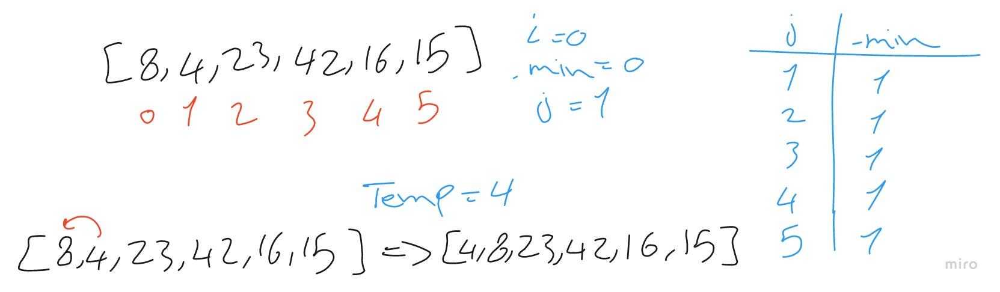
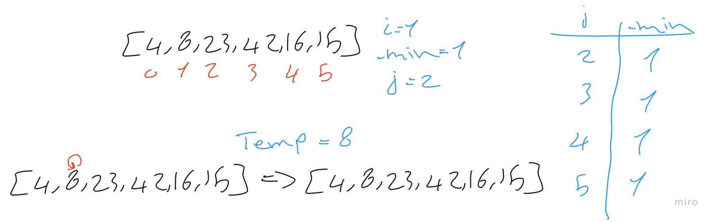
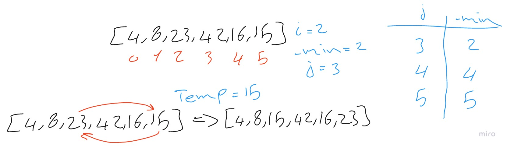
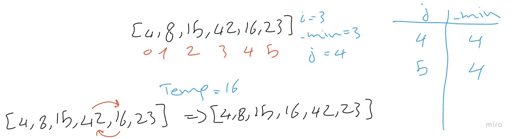
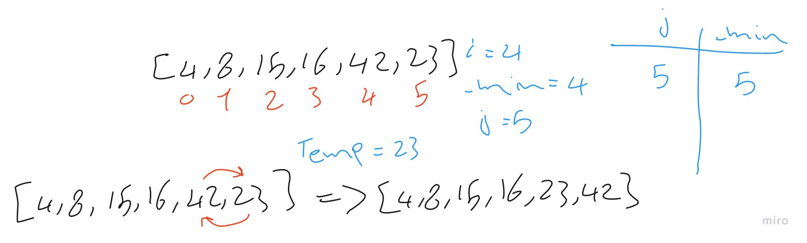

# Insertion Sort

Insertion sort is a simple sorting algorithm that works similar to the way you sort playing cards in your hands.

The array is virtually split into a sorted and an unsorted part.

Values from the unsorted part are picked and placed at the correct position in the sorted part.

## Algorithm

* loop through the array and compare the current index value with the next values and for that we need inner loop to loop through the rest values in the array.
* in each iteration of the inner loop check if there are a value less than the current value.
* if there is then change the index of the current value with the found value.
* if not continue with the next iteration.

## Pseudocode

```python
SelectionSort(int[] arr)
    DECLARE n <-- arr.Length;
    FOR i = 0; i to n - 1  
        DECLARE min <-- i;
        FOR j = i + 1 to n
            if (arr[j] < arr[min])
                min <-- j;

        DECLARE temp <-- arr[min];
        arr[min] <-- arr[i];
        arr[i] <-- temp;
```

## Trace

Sample Array: [8,4,23,42,16,15]

### Pass 1:



In the main loop we take the first index of i = 0 and compare it to the rest of the array's value within the second loop and we found that the index of 1 is less than the index of 0 so we swap the indexes values.

### Pass 2:



In the main loop we take the second index of i = 1 and compare it to the rest of the values in the array within the second loop and we didn't found value less than it so we kept the array as it is.

### Pass 3:



In the main loop we take the third index of i = 2 and compare it to the rest of the array's value within the second loop and at first we found that the index of 4 is less than the index of 2 and then we found that the index of 5 is less than the index of 4 so we swap the index of 2 with index of 5.

### Pass 4:



In the main loop we take the third index of i = 3 and compare it to the rest of the array's value within the second loop and we found that the index of 4 is less than the index of 3 so we swap the index of 3 with index of 4.

### Pass 5:



In the main loop we take the third index of i = 4 and compare it to the rest of the array's value within the second loop and we found that the index of 5 is less than the index of 4 so we swap the index of 4 with index of 5.

## Efficency

* Time: O(n^2)
   * The basic operation of this algorithm is comparison. This will happen n * (n-1) number of time concluding the algorithm to be n squared.
* Space: O(1)
   * No additional space is being created. This array is being sorted in place keeping the space at constant O(1).
