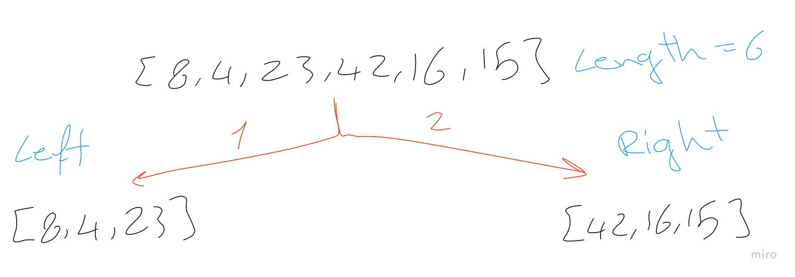
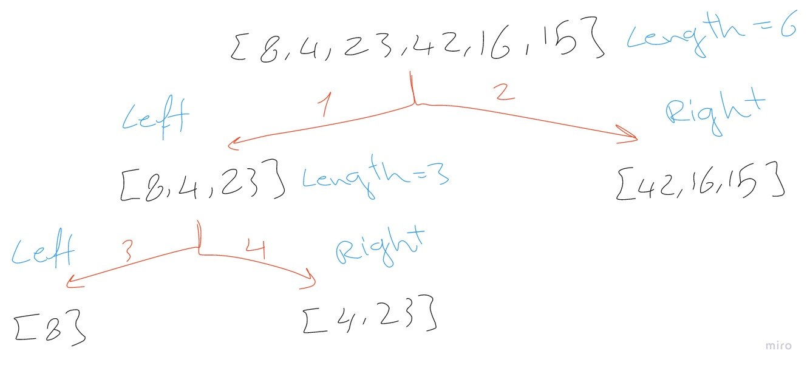
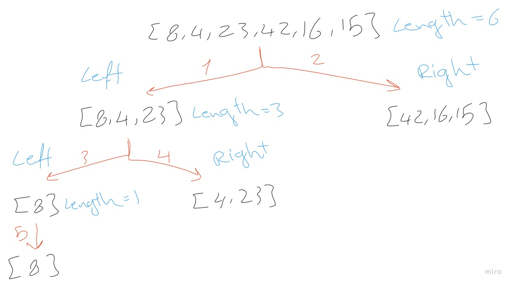
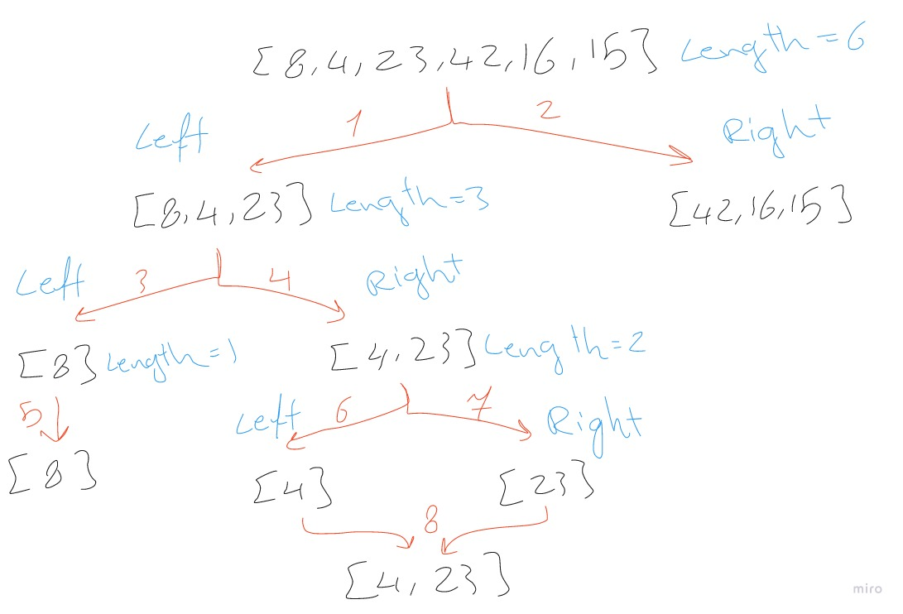
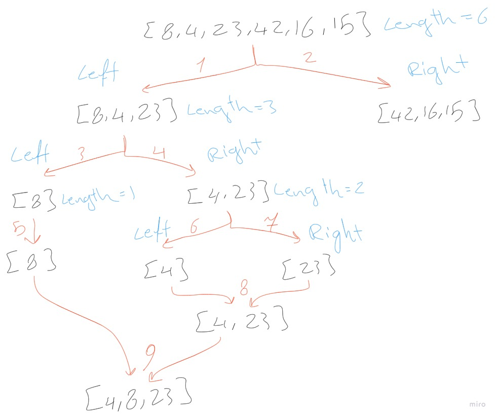
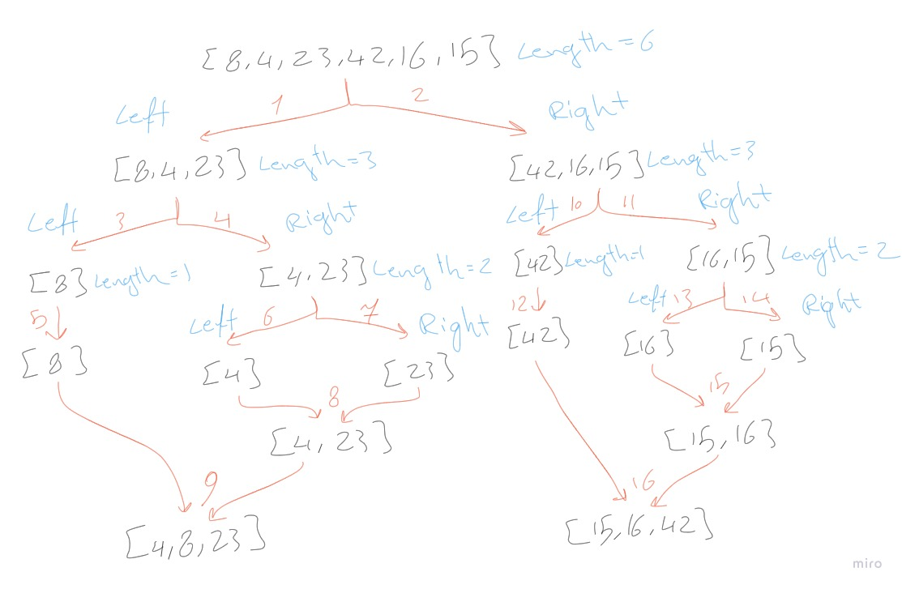
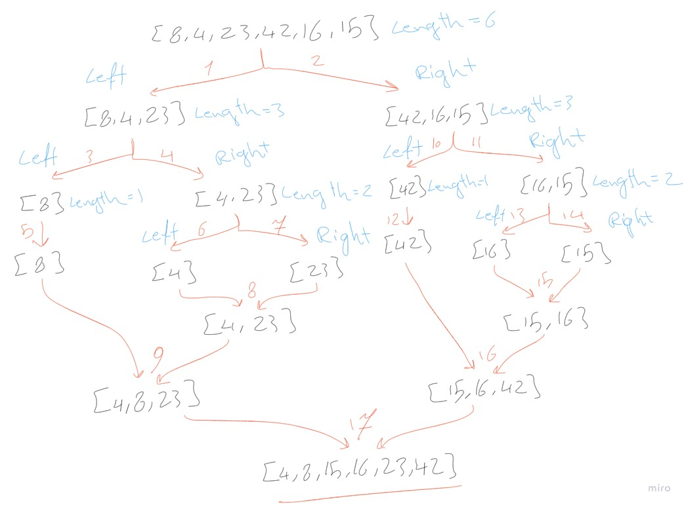

# Merge Sort

Merge Sort is a Divide and Conquer algorithm. It divides the input array into two halves, calls itself for the two halves, and then merges the two sorted halves.

## Algorithm


## Pseudocode

```python
ALGORITHM Mergesort(arr)
    DECLARE n <-- arr.length

    if n > 1
      DECLARE mid <-- n/2
      DECLARE left <-- arr[0...mid]
      DECLARE right <-- arr[mid...n]
      // sort the left side
      Mergesort(left)
      // sort the right side
      Mergesort(right)
      // merge the sorted left and right sides together
      Merge(left, right, arr)

ALGORITHM Merge(left, right, arr)
    DECLARE i <-- 0
    DECLARE j <-- 0
    DECLARE k <-- 0

    while i < left.length && j < right.length
        if left[i] <= right[j]
            arr[k] <-- left[i]
            i <-- i + 1
        else
            arr[k] <-- right[j]
            j <-- j + 1

        k <-- k + 1

    if i = left.length
       set remaining entries in arr to remaining values in right
    else
       set remaining entries in arr to remaining values in left
```

## Trace

Sample Array: [8,4,23,42,16,15]

### Pass 1:



At first the we divide the array into two arrays left and right.

### Pass 2:



Then we do the same for the left array and divide it into left and right.

### Pass 3:



Here we repeat the same step again on the left array but it's length is equal to 1 so we will jump to the right array.

### Pass 4:



The right array has two elements so we divide it into left and right then we compare the left with the right and put the smaller into a new array then the bigger.

### Pass 5:



And then we compare the left array element with the new array elements and put the smaller into a new array then the bigger and we get an array with sorted elements.

### Pass 6:



Then we repeat the same previous steps on the first right array to get a new array with sorted elements.

### Pass 7:



At last we merge the two left and right arrays by comparing the elements and put the smaller into a new array then the bigger and we get a sorted array.

## Efficency

* Time: O(n*Log(n))
   * Merge Sort is a recursive algorithm as merge sort always divides the array into two halves and takes linear time to merge two halves.
* Space: O(n)
   * Merge Sort take additional space while merging the left and right array into new arrays.
