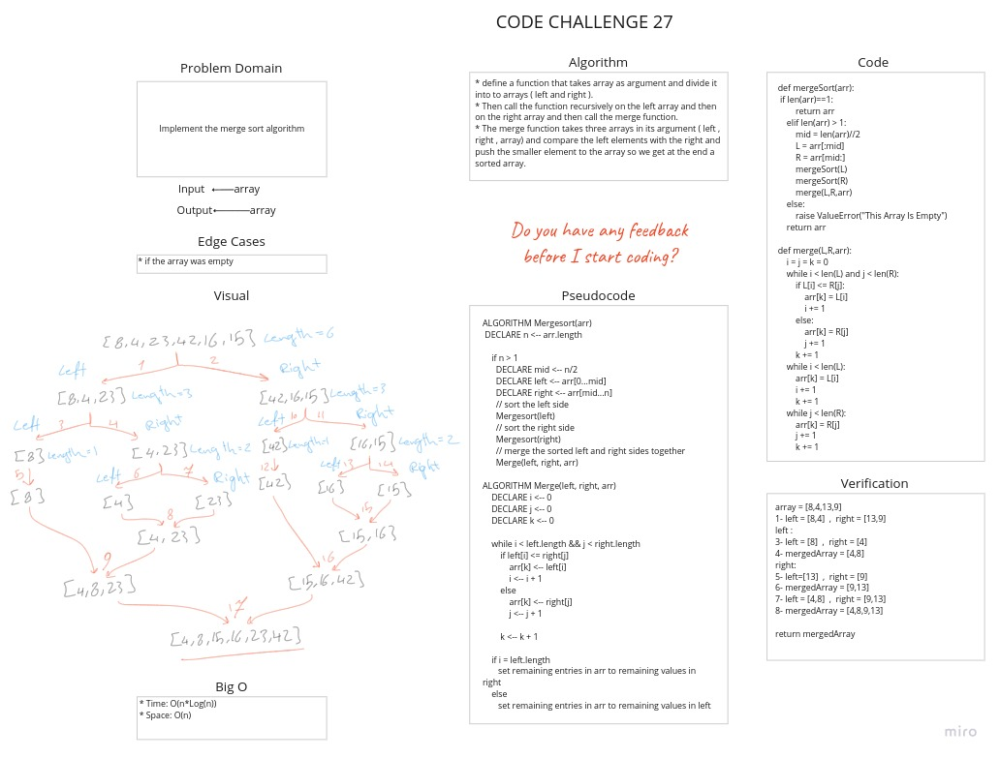

# Challenge Summary

Implement the merge sort algorithm

## Whiteboard Process



## Approach & Efficiency

* Time: O(n*Log(n))
   * Merge Sort is a recursive algorithm as merge sort always divides the array into two halves and takes linear time to merge two halves.
* Space: O(n)
   * Merge Sort take additional space while merging the left and right array into new array.

## Solution

[Link To Code](merge_sort.py)

```python
array = [8,4,13,9]
1- left = [8,4]  ,  right = [13,9]
left :
3- left = [8]  ,  right = [4]
4- mergedArray = [4,8]
right:
5- left=[13]  ,  right = [9]
6- mergedArray = [9,13]
7- left = [4,8]  ,  right = [9,13]
8- mergedArray = [4,8,9,13]

return mergedArray

```

## BLOG

[Link To BLOG](BLOG.md)
