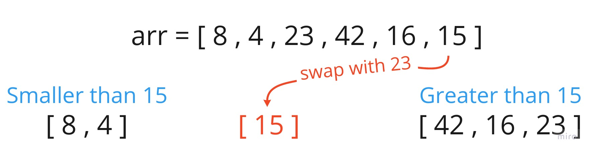
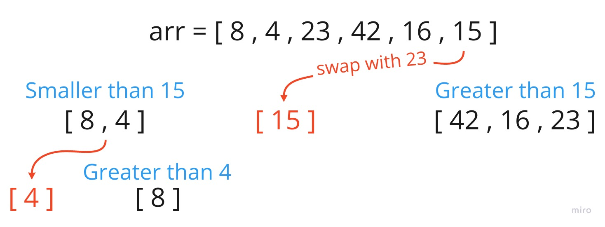
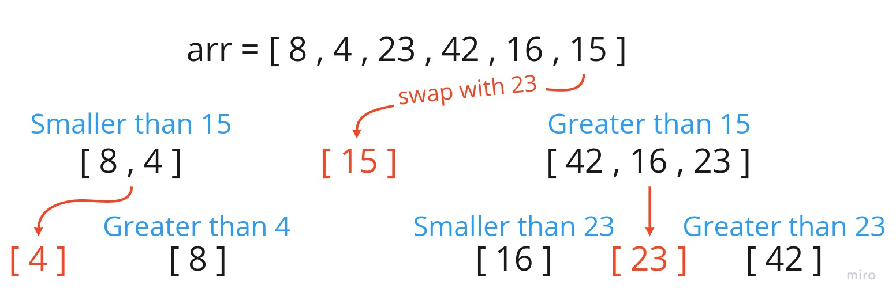
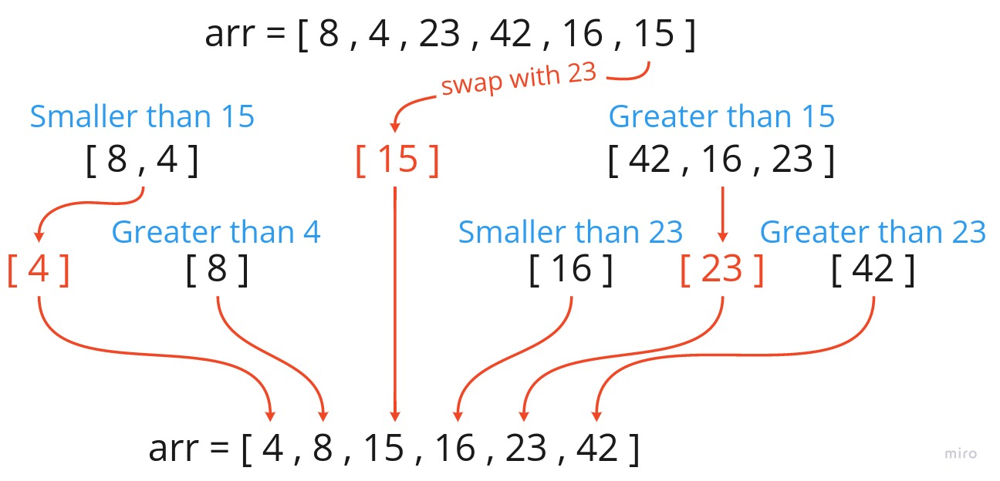

# Quick Sort

QuickSort is a Divide and Conquer algorithm. It picks an element as pivot and partitions the given array around the picked pivot.

There are many different versions of quickSort that pick pivot in different ways.

1. Always pick first element as pivot.
2. Always pick last element as pivot (implemented below)
3. Pick a random element as pivot.
4. Pick median as pivot.

## Pseudocode

```python
ALGORITHM QuickSort(arr, left, right)
    if left < right
        // Partition the array by setting the position of the pivot value
        DEFINE position <-- Partition(arr, left, right)
        // Sort the left
        QuickSort(arr, left, position - 1)
        // Sort the right
        QuickSort(arr, position + 1, right)

ALGORITHM Partition(arr, left, right)
    // set a pivot value as a point of reference
    DEFINE pivot <-- arr[right]
    // create a variable to track the largest index of numbers lower than the defined pivot
    DEFINE low <-- left - 1
    for i <- left to right do
        if arr[i] <= pivot
            low++
            Swap(arr, i, low)

     // place the value of the pivot location in the middle.
     // all numbers smaller than the pivot are on the left, larger on the right.
     Swap(arr, right, low + 1)
    // return the pivot index point
     return low + 1

ALGORITHM Swap(arr, i, low)
    DEFINE temp;
    temp <-- arr[i]
    arr[i] <-- arr[low]
    arr[low] <-- temp
```

## Trace

Sample Array: [8,4,23,42,16,15]

### Pass 1:



At first we take the last element as pivot and check the array for the values that are smaller than the pivot and swap it.

### Pass 2:



Then we take the smaller values and repeate the same step on them and do the swap.

### Pass 3:



Then we repeate the same steps in pass 1 on the values that are greater.

### Pass 4:



At last we will get the final array sorted.

## Efficency

* Time: O(n^2)
   * Quick Sort is a recursive algorithm as quick sort always divides the array into two halves and call it self on each half again.
* Space: O(1)
   * No additional space is being created. This array is being sorted in place keeping the space at constant O(1).
