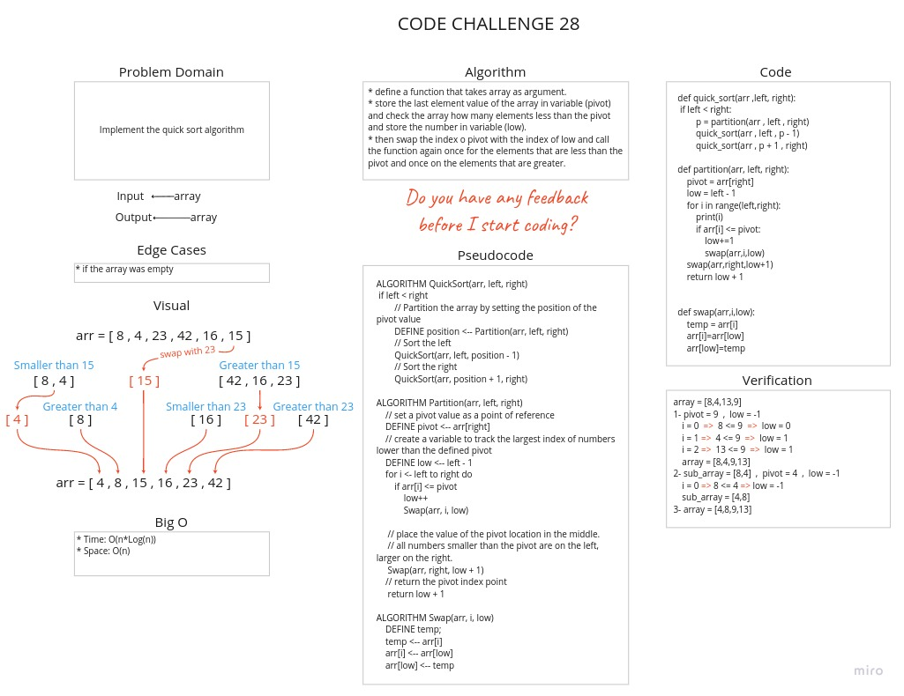

# Challenge Summary

Implement the quick sort algorithm

## Whiteboard Process



## Approach & Efficiency

* Time: O(n^2)
   * Quick Sort is a recursive algorithm as quick sort always divides the array into two halves and call it self on each half again.
* Space: O(1)
   * No additional space is being created. This array is being sorted in place keeping the space at constant O(1).

## Solution

[Link To Code](quick_sort.py)

```python
array = [8,4,13,9]
1- pivot = 9  ,  low = -1
 i = 0  -->  8 <= 9  -->  low = 0
 i = 1 -->  4 <= 9  -->  low = 1
 i = 2 -->  13 <= 9  -->  low = 1
 array = [8,4,9,13]
2- sub_array = [8,4]  ,  pivot = 4  ,  low = -1
 i = 0 --> 8 <= 4 --> low = -1
 sub_array = [4,8]
3- array = [4,8,9,13]
```

## BLOG

[Link To BLOG](BLOG.md)
