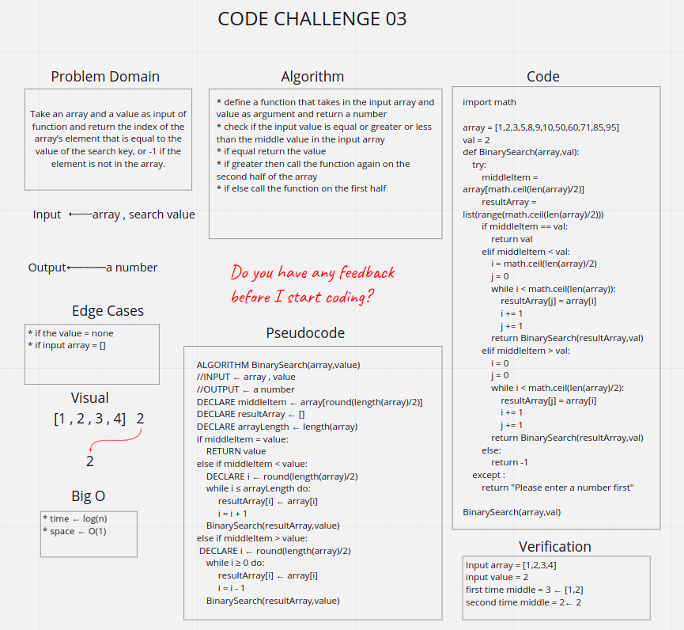

# Binary Search
Take an array and a value as input of function and return the index of the array’s element that is equal to the value of the search key, or -1 if the element is not in the array.

## Whiteboard Process

## Approach & Efficiency
* For time log(n)
* For space O(1)