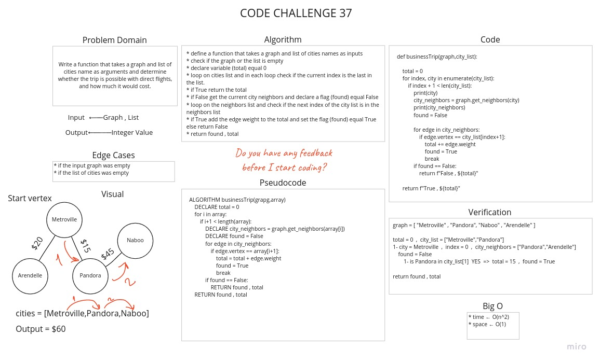

# Challenge Summary

Write a function that takes a graph and list of cities name as arguments and determine whether the trip is possible with direct flights, and how much it would cost.

## Whiteboard Process



## Approach & Efficiency

* Time: O(n^2)
* Space: O(1)

## Solution

[Code Link](graph_business_trip.py)

[Test Link](../../tests/test_graph_trip.py)

```python
graph = [ "Metroville" , "Pandora", "Naboo" , "Arendelle" ]

total = 0  ,  city_list = ["Metroville","Pandora"] 
1- city = Metroville  ,  index = 0  ,  city_neighbors = ["Pandora","Arendelle"]
 found = False
  1- is Pandora in city_list[1]  YES  =>  total = 15  ,  found = True

return found , total
```