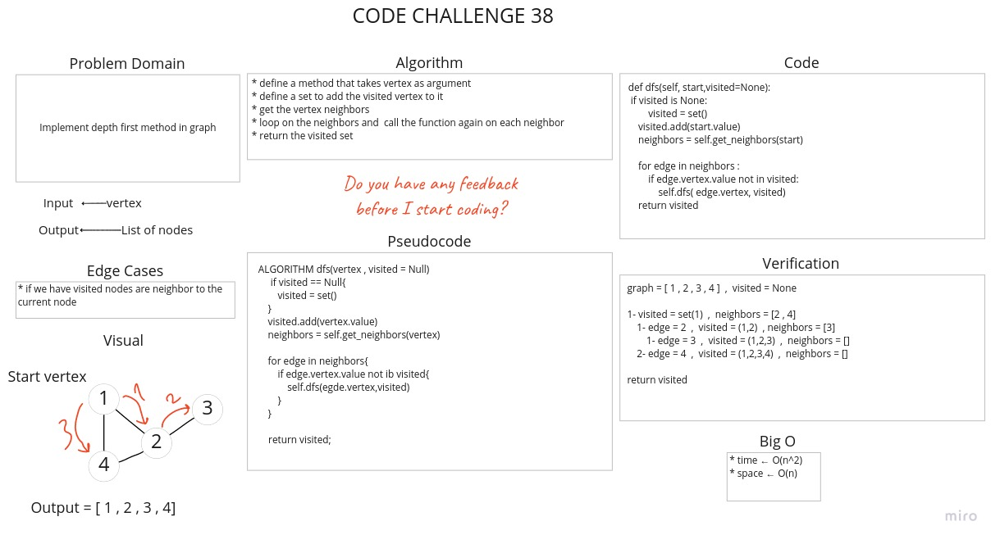

# Graphs

A graph is a non-linear data structure that can be looked at as a collection of vertices (or nodes) potentially connected by line segments named edges.

## Challenge

Implementing a Graph represented as an adjacency list and implement breadth first method and implement depth first method.

## Whiteboard Process




## Approach & Efficiency

* Time: O(1)
  * AddNode(): O(1)
  * AddEdge(): O(1)
  * GetNodes(): O(1)
  * Size(): O(1)
  * bfs() : O(n^3)
  * dfs() : O(n^2)
* Space: O(n+m)
  * AddNode(): O(n)
  * AddEdge(): O(m)
  * GetNodes(): O(1)
  * Size(): O(1)
  * bfs() : O(n)
  *dfs() : O(n)

## API

* **`AddNode`** method :
  * Adds a new node to the graph.
  * Input : Takes in the value of that node.
  * Returns : The added node.
* **`AddEdge`** method :
  * Adds a new edge between two nodes in the graph include the ability to have a “weight”.
  * Input : Two nodes to be connected by the edge.
  * Returns : Nothing.
* **`GetNodes`** method :
  * Get all of the nodes in the graph as a set or list.
  * Input : Nothing.
  * Returns : A list or set of all nodes in the graph.
* **`GetNeighbors`** method :
  * Get a collection of edges connected to the given node.
  * Input : A node.
  * Returns : List of edges connected to the given node.
* Size():
  * Get the total number of nodes in the graph.
  * Input : Nothing.
  * Returns : Number of the nodes in the graph.
* BFS():
  * Get a collection of nodes in the order they were visited.
  * Input : Node.
  * Returns : A list of nodes in the order they were visited.
* DFS():
  * Get a collection of nodes in their pre-order depth-first traversal order.
  * Input : Node.
  * Returns : A list of nodes in their pre-order depth-first traversal order.

## Solution

[Code Link](graph.py)

[Test Link](../../tests/test_graph.py)

```python
graph = [ 1 , 2 , 3 , 4 ]

queue = [1]  ,  result = [1]  ,  visited = (1)
1- current = 1 , queue = []  ,  neighbors = [ 2 , 4 ]
   1- is 2 in visited NO => queue = [2]  ,  visited = (1 , 2)  ,  result = [1 , 2]
   2- is 4 in visited NO => queue = [2,4]  , visited = (1,2,4) , result = [1,2,4]
2- current = 2 , queue = [4] ,  neighbors = [1 , 4 , 3]
   1- is 1 in visited YES
   2- is 4 in visited YES
   3- is 3 in visited NO => queue = [4,3] , visited = (1,2,4,3) , result = [1,2,4,3]
3- current = 4 , queue = [3] , neighbors = [1 , 2]
   1- is 1 in visited YES
   2- is 2 in visited YES
4- current = 3 , queue = [] , neighbors = [2]
   1- is 2 in visited YES

return result
```
