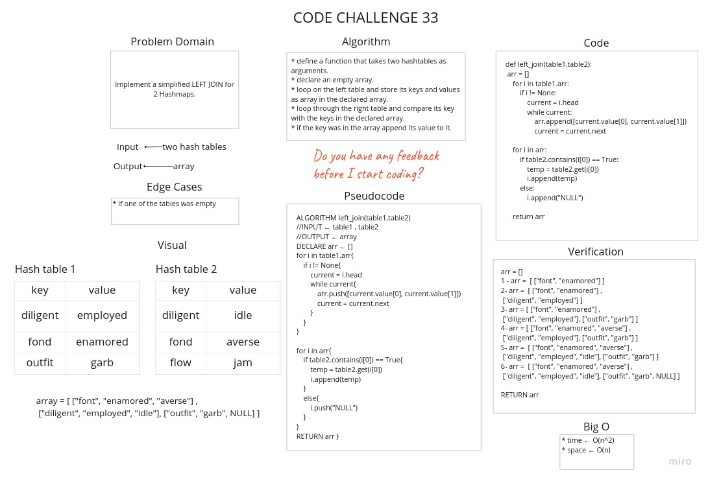

# Hashmap LEFT JOIN

The **`LEFT JOIN`** returns all records from the left table (table1), and the matching records from the right table (table2). 

## Challenge

Write a function that **`LEFT JOINs`** two hashmaps into a single data structure.

## Approach & Efficiency

* Time : O(n^2)
* Space : O(n)

## Solution

[Link To Code](hashmap_left_join.py)

[Link To Tests](tests/test_left_join.py)
