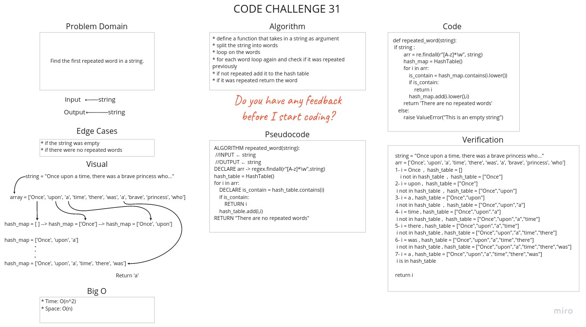

# Challenge Summary

Find the first repeated word in a string.

## Whiteboard Process



## Approach & Efficiency

* Time : O(n^2)
        * We loop through the array that contain the words and then inside the loop we loop again using contains method from hashtable class.
* Space : O(n)
        * We use array to store the splited words and we don't know how many words are there and also we used the map array inside the hashtable.

## Solution

[Link To Code](hashmap_repeated_word.py)

```python
string = "Once upon a time, there was a brave princess who..."
arr = ['Once', 'upon', 'a', 'time', 'there', 'was', 'a', 'brave', 'princess', 'who']
1- i = Once  ,  hash_table = []
 i not in hash_table  ,  hash_table = ["Once"]
2- i = upon ,  hash_table = ["Once"]
 i not in hash_table  ,  hash_table = ["Once","upon"]
3- i = a , hash_table = ["Once","upon"]
 i not in hash_table  ,  hash_table = ["Once","upon","a"]
4- i = time , hash_table = ["Once","upon"."a"]
 i not in hash_table ,  hash_table = ["Once","upon","a","time"]
5- i = there , hash_table = ["Once","upon","a","time"]
 i not in hash_table , hash_table = ["Once","upon","a","time","there"]
6- i = was , hash_table = ["Once","upon","a","time","there"]
 i not in hash_table , hash_table = ["Once","upon","a","time","there","was"]
7- i = a , hash_table = ["Once","upon","a","time","there","was"]
 i is in hash_table

return i
```
