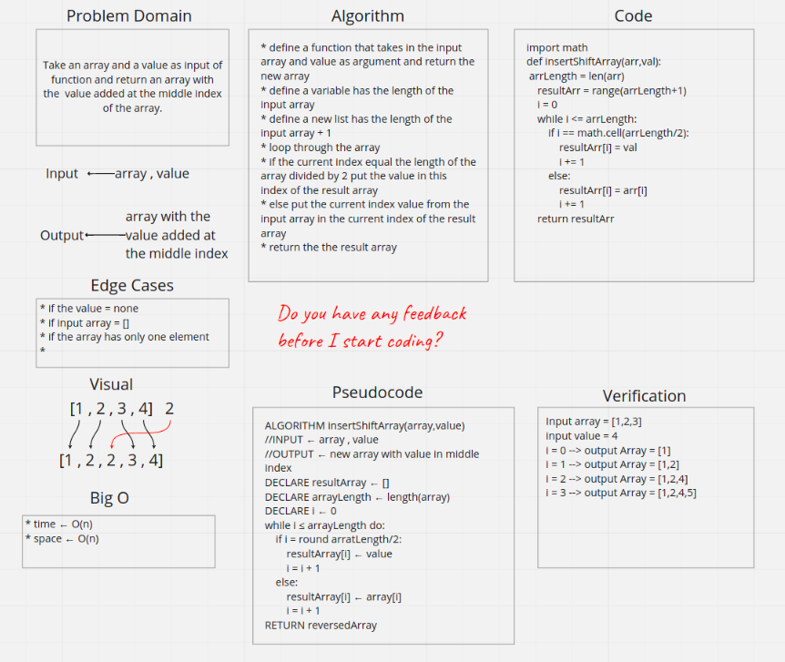

# Reverse an Array
Take an array and a value as input of function and return an array with the  value added at the middle index of the array.

## Whiteboard Process

## Approach & Efficiency
* For time O(n)
* For space O(n)