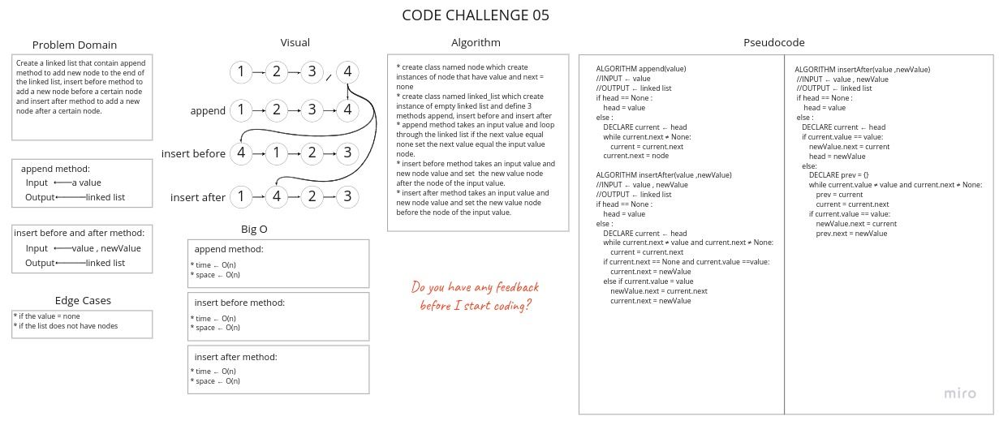
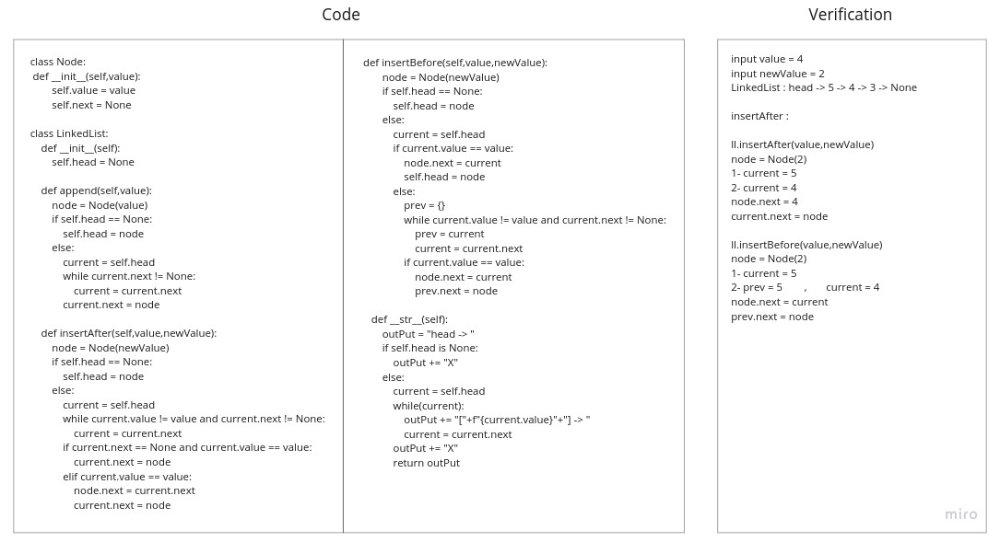
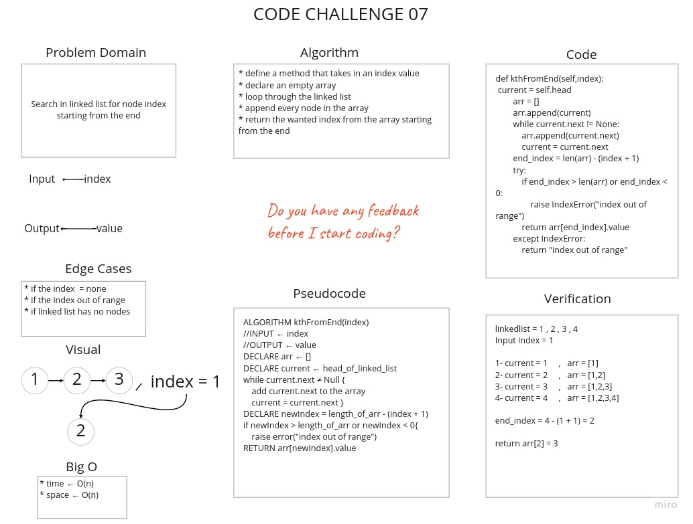
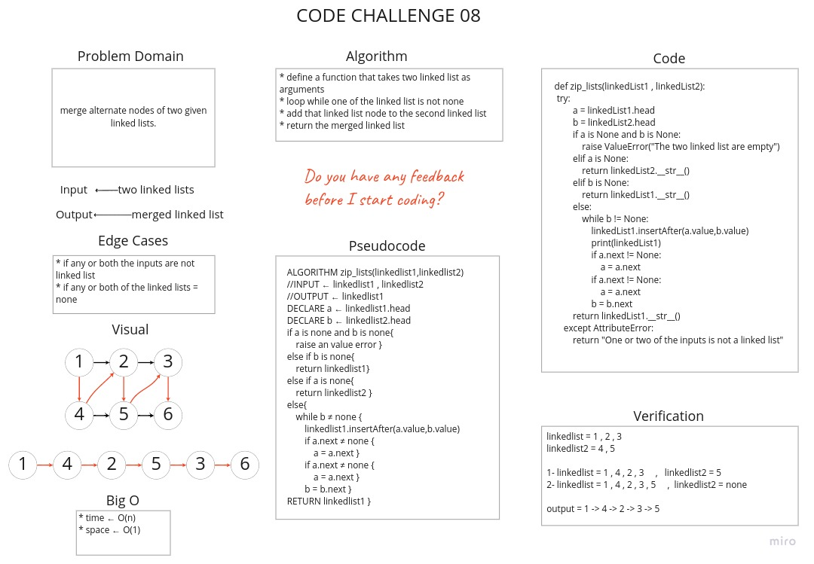

# Challenge Summary
**`Linked List Insertions`** :

Create a linked list that contain append, insert before and insert after methods:
* **`append method`** : to add new node to the end of the linked list
* **`insert before`** : to insert new node immediately before a certain node that has the value specified.
* **`insert after`** : to insert new node immediately after the a certain node that has the value specified.
* **`kth from the end`** : Search in linked list for node index starting from the end.
* **`zip two linked lists`** : merge alternate nodes of two given linked lists.

## Whiteboard Process









## Approach & Efficiency
1. append method:
   * time ← O(n)
   * space ← O(n)
2. insert before method:
   * time ← O(n)
   * space ← O(n)
3. insert after method:
   * time ← O(n)
   * space ← O(n)
4. kth from end method:
   * time ← O(n)
   * space ← O(n)
5. zip two linked lists function:
   * time ← O(n)
   * space ← O(1)

## Solution

[Link to Code](linked_list_insertions.py)

```python
input value = 4
input newValue = 2
LinkedList : head -> 5 -> 4 -> 3 -> None

ll.insertAfter(value,newValue)
node = Node(2)

1- current = 5
2- current = 4

node.next = 4
current.next = node

-------------------------------------------------

ll.insertBefore(value,newValue)
node = Node(2)

1- current = 5
2- prev = 5        ,   current = 4

node.next = current
prev.next = node

-------------------------------------------------

ll.kthFromEnd(1)
node = Node(2)
arr = []

1- current = 1     ,   arr = [5]
2- current = 2     ,   arr = [5,4]
3- current = 3     ,   arr = [5,4,3]

end_index = 3 - (1 + 1) = 1
return arr[end_index]

output = 4

-------------------------------------------------

linkedlist = 1 , 2 , 3
linkedlist2 = 4 , 5

1- linkedlist = 1 , 4 , 2 , 3     ,   linkedlist2 = 5
2- linkedlist = 1 , 4 , 2 , 3 , 5     ,  linkedlist2 = none

output = 1 -> 4 -> 2 -> 3 -> 5
```