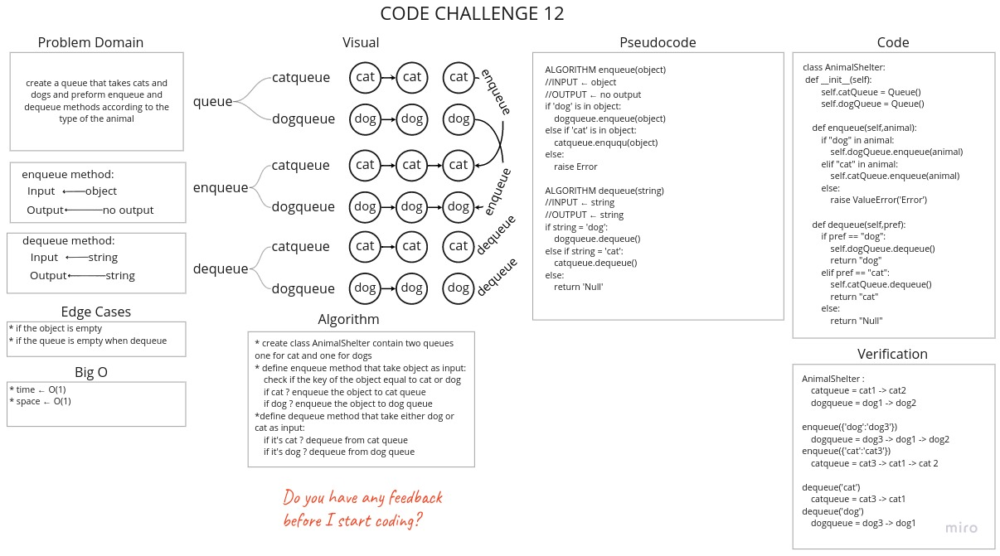

# Challenge Summary
Create a queue that takes cats and dogs and preform enqueue and dequeue methods according to the type of the animal.

## Whiteboard Process



## Approach & Efficiency
* **`Enqueue`** :
    * time ← O(1)
    * space ← O(1)
* **`Dequeue`** :
    * time ← O(1)
    * space ← O(1)

## Solution

[Link to Code](stack_queue_animal_shelter.py)

```python
AnimalShelter :
 catqueue = cat1 -> cat2
 dogqueue = dog1 -> dog2

enqueue({'dog':'dog3'})
 dogqueue = dog3 -> dog1 -> dog2
enqueue({'cat':'cat3'})
 catqueue = cat3 -> cat1 -> cat 2

dequeue('cat')
 catqueue = cat3 -> cat1
dequeue('dog')
 dogqueue = dog3 -> dog1
```