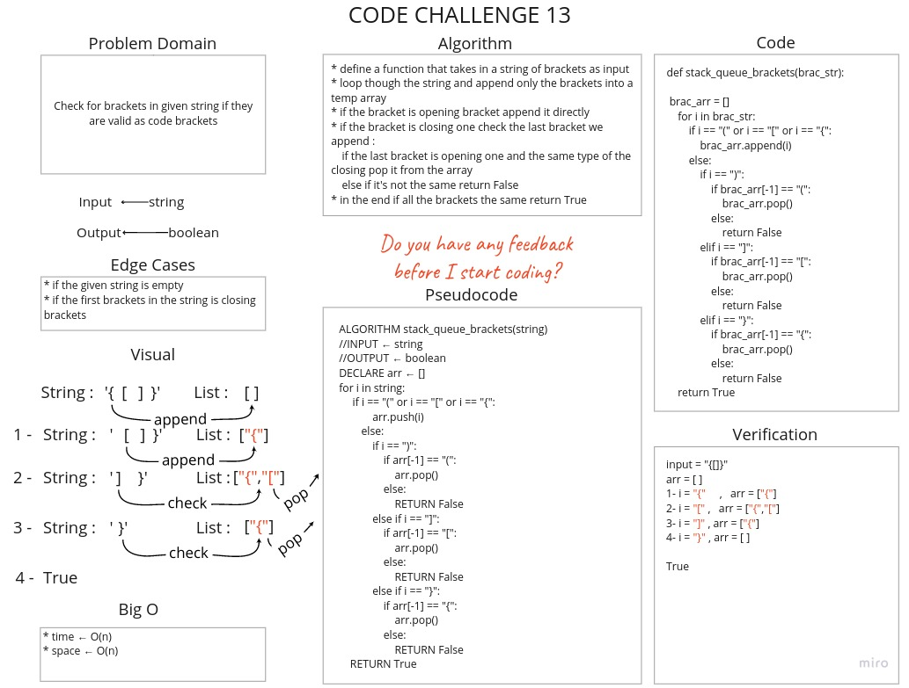

# Challenge Summary
Check for brackets in given string if they are valid as code brackets.

## Whiteboard Process


## Approach & Efficiency
* Time = O(n)
* Soace = O(n)

## Solution

[Link to Code](stack_queue_brackets.py)

```python
input = "{[]}"
arr = [ ]
1- i = "{"     ,   arr = ["{"]
2- i = "[" ,   arr = ["{","["]
3- i = "]" , arr = ["{"]
4- i = "}" , arr = [ ]

True
```