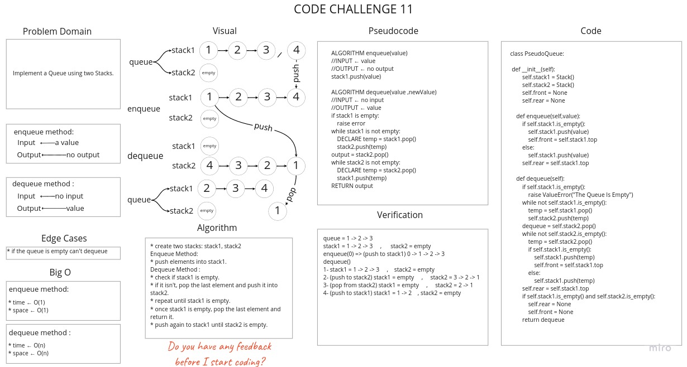

# Challenge Summary
Implement a Queue using two Stacks.

## Whiteboard Process


## Approach & Efficiency
* **`Enqueue`** :
   * Time : O(1)
   * Space : O(1)
* **`Dequeue`** :
   * Time : O(n)
   * Space : O(n)

## Solution

[Link to Code](stack_queue_pseudo.py)

```python
queue = 1 -> 2 -> 3
stack1 = 1 -> 2 -> 3     ,      stack2 = empty
enqueue(0) => (push to stack1) 0 -> 1 -> 2 -> 3
dequeue()
1- stack1 = 1 -> 2 -> 3     ,    stack2 = empty
2- (push to stack2) stack1 = empty     ,     stack2 = 3 -> 2 -> 1
3- (pop from stack2) stack1 = empty     ,     stack2 = 2 -> 1
4- (push to stack1) stack1 = 1 -> 2    , stack2 = empty
```
