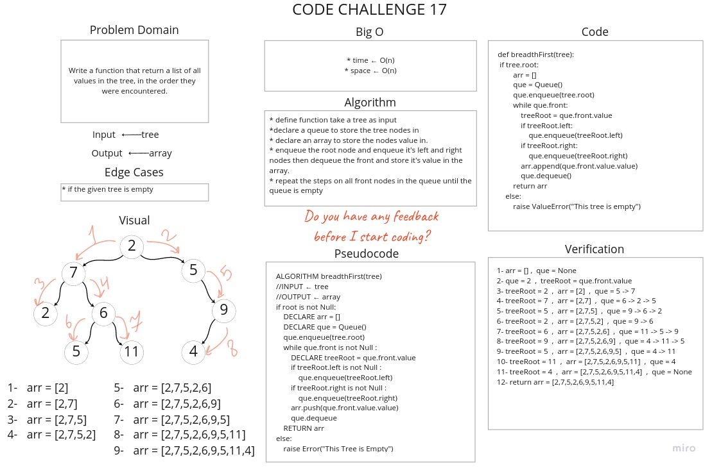

# Challenge Summary
Write a function that return a list of all values in the tree, in the order they were encountered.

## Whiteboard Process


## Approach & Efficiency
* Time : O(n)
* Space : O(n)

## Solution

[Link to Code](tree_breadth_first.py)

```python
1- arr = []  ,  que = None
2- que = 2  ,  treeRoot = que.front.value
3- treeRoot = 2  ,  arr = [2]  ,  que = 5 -> 7
4- treeRoot = 7  ,  arr = [2,7]  ,  que = 6 -> 2 -> 5
5- treeRoot = 5  ,  arr = [2,7,5]  ,  que = 9 -> 6 -> 2
6- treeRoot = 2  ,  arr = [2,7,5,2]  ,  que = 9 -> 6
7- treeRoot = 6  ,  arr = [2,7,5,2,6]  ,  que = 11 -> 5 -> 9
8- treeRoot = 9  ,  arr = [2,7,5,2,6,9]  ,  que = 4 -> 11 -> 5
9- treeRoot = 5  ,  arr = [2,7,5,2,6,9,5]  ,  que = 4 -> 11
10- treeRoot = 11  ,  arr = [2,7,5,2,6,9,5,11]  ,  que = 4
11- treeRoot = 4  ,  arr = [2,7,5,2,6,9,5,11,4]  ,  que = None
12- return arr = [2,7,5,2,6,9,5,11,4]
```