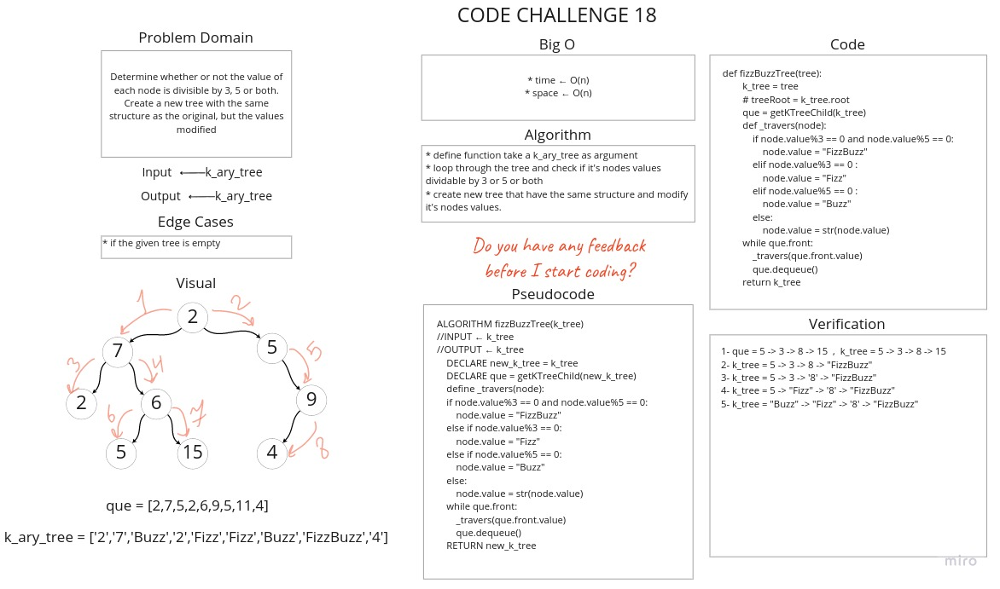

# Challenge Summary

Determine whether or not the value of each node is divisible by 3, 5 or both. Create a new tree with the same structure as the original, but the values modified

## Whiteboard Process



## Approach & Efficiency

* Time : O(n)
* Space : O(n)

## Solution

[Link to Code](tree_fizz_buzz.py)

```python
1- que = 5 -> 3 -> 8 -> 15  ,  k_tree = 5 -> 3 -> 8 -> 15
2- k_tree = 5 -> 3 -> 8 -> "FizzBuzz"
3- k_tree = 5 -> 3 -> '8' -> "FizzBuzz"
4- k_tree = 5 -> "Fizz" -> '8' -> "FizzBuzz"
5- k_tree = "Buzz" -> "Fizz" -> '8' -> "FizzBuzz"
```