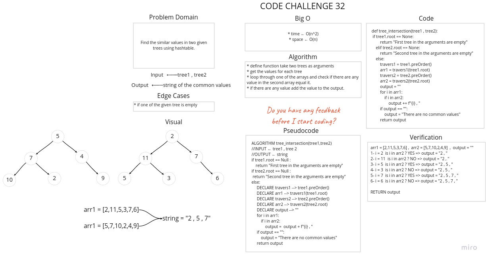

# Challenge Summary

Find the similar values in two given trees using hashtable.

## Whiteboard Process



## Approach & Efficiency

* Time : O(n^2)
        * We loop through the first array and then we loop again inside it to check if the value is in the second array.
* Space : O(n)
        * We use arrays to store the trees values and we don't know the number of branch in the tree so the space will be (n).

## Solution

[Link To Code](tree_intersection.py)

```python
arr1 = [2,11,5,3,7,6]  ,  arr2 = [5,7,10,2,4,9]  ,  output = ""
1- i = 2  is i in arr2 ? YES => output = "2 , "
2- i = 11  is i in arr2 ? NO => output = "2 , "
3- i = 5  is i in arr2 ? YES => output = "2 , 5 , "
4- i = 3  is i in arr2 ? NO => output = "2 , 5 , "
5- i = 7  is i in arr2 ? YES => output = "2 , 5 , 7 , "
6- i = 6  is i in arr2 ? NO => output = "2 , 5 , 7 , "

RETURN output
```
