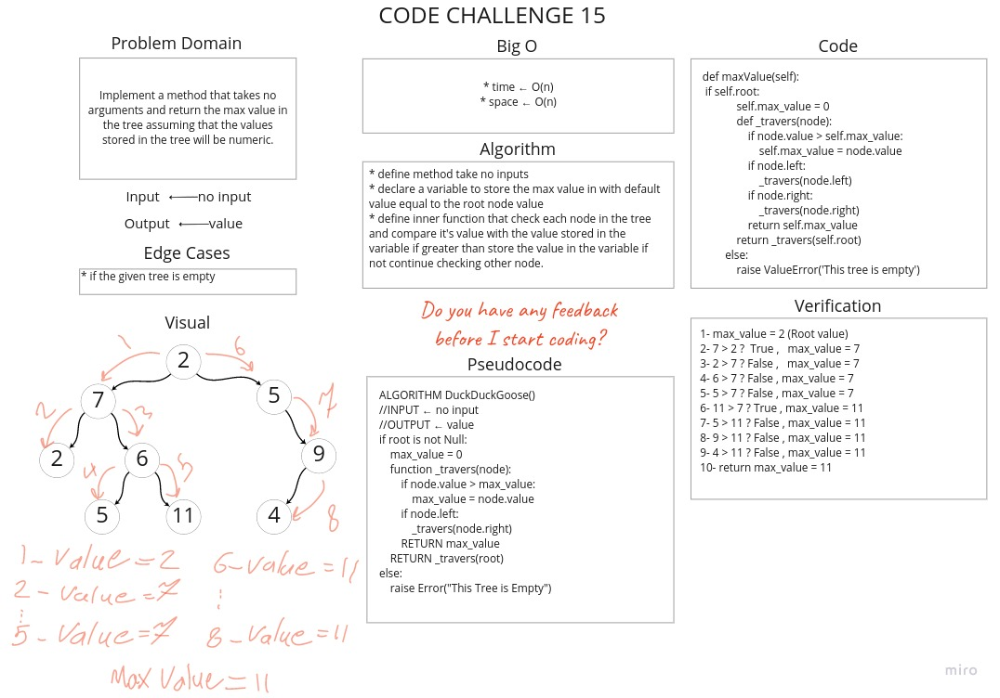

# Challenge Summary
Implement a method that takes no arguments and return the max value in the tree assuming that the values stored in the tree will be numeric.

## Whiteboard Process



## Approach & Efficiency
* Time : O(n)
* Space : O(n)

## Solution

[Link to Code](tree_max.py)

```python
1- max_value = 2 (Root value)
2- 7 > 2 ?  True ,   max_value = 7
3- 2 > 7 ? False ,   max_value = 7
4- 6 > 7 ? False , max_value = 7
5- 5 > 7 ? False , max_value = 7
6- 11 > 7 ? True , max_value = 11
7- 5 > 11 ? False , max_value = 11
8- 9 > 11 ? False , max_value = 11
9- 4 > 11 ? False , max_value = 11
10- return max_value = 11
```